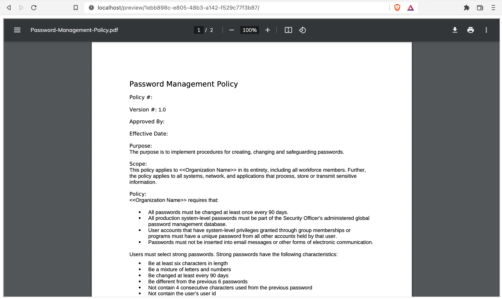

# Docx to PDF converter

This repo is a web tool writing on Django, Celery, Gunicorn, Nginx and Rabbitmq

## Setup
<code>docker-compose up --build</code>

This command build and run docker containers on :80 port

If you want change password just make this in file settings.py and docker-compose.yml

## Site
### Main page

### Upload file

### Converting image

### Pdf file

<strong>Good luck to use</strong>
